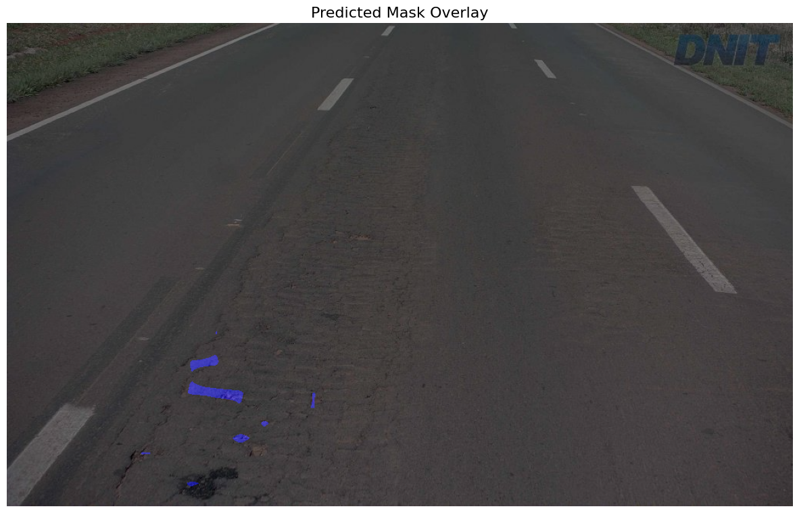
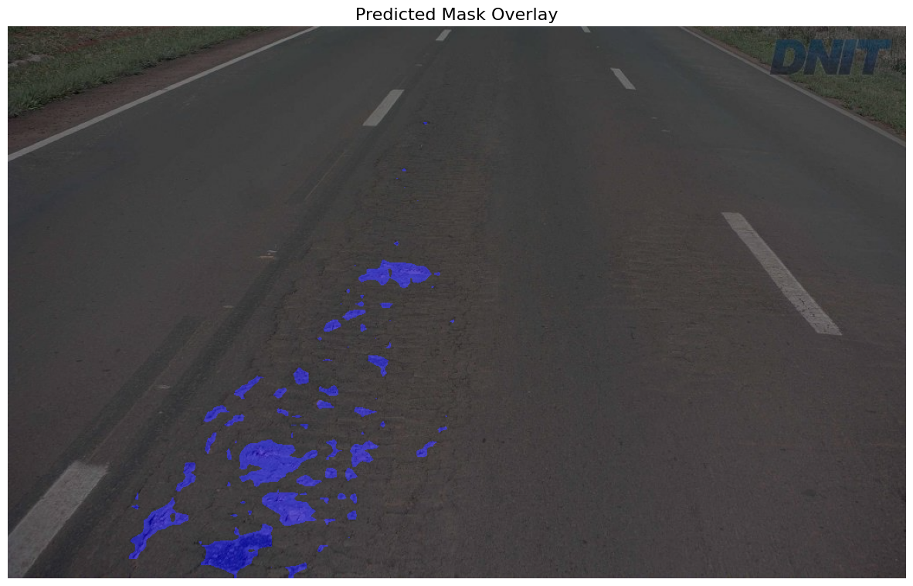
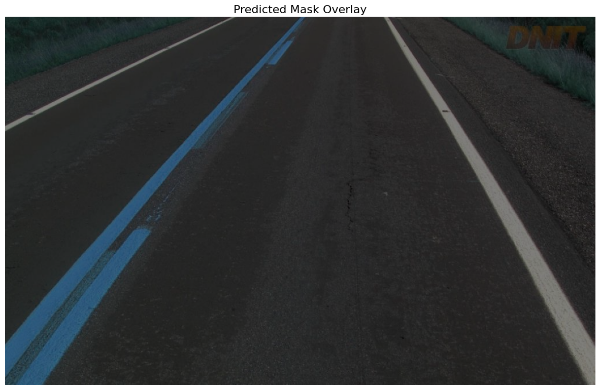
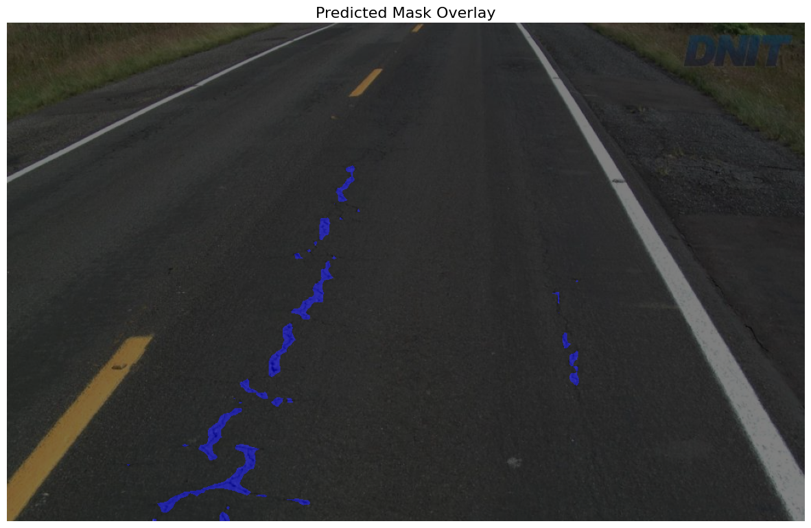

# RADAR: Road Analysis and Damage Assessment Research

RADAR (Road Analysis and Damage Assessment Research) is a research project where we fine-tuned and implemented state-of-the-art models like **DINOv2** and **SegFormer** for damage detection in road images. The project lets users train models on given dataset and run inference to detect and identify damage areas in road images.

This README has all the necessary instructions for setting up and using the RADAR project on Windows, WSL, and Linux systems with CUDA support.

## Table of Contents

1.  Prerequisites
2.  Setup Instructions
3.  Running the Project
    -   Training
    -   Inference
4. Detailed Command Usage
5. Configuration File
6. Training Models 
7. Running Inference
8. Combined Training and Inference
9. Inference Results
10. Troubleshooting

> **Note**: This project has been successfully built and tested on Windows with WSL/Linux. We highly recommend to run this project in a similar environment.


## Prerequisites

-   **Python 3.8+** is required. Make sure it's installed and accessible via the `python3` command.
-   **CUDA** is necessary for both training and inference, as the models are trained using GPU acceleration.
-   **Pip** is used to install dependencies.
-   **OpenCV**: If not already installed, the script will automatically install OpenCV.
-   **Git**: Ensure that Git is available to clone the repository.

## Setup Instructions
### 1. Create a Python Virtual Environment

To avoid conflicts with other Python projects, it is highly recommended to create a fresh virtual environment. Follow these steps:

1.  **Create a new virtual environment**:
 
    `python3 -m venv radar_env` 
    
3.  **Activate the virtual environment**:
    
    -   On **Windows**:
                
        `.\radar_env\Scripts\activate` 
        
    -   On **Linux/macOS**:

		```sh
		source radar_env/bin/activate
		```
         
        
4.  **Upgrade pip** (optional but recommended):
        
    ```python
	pip install --upgrade pip    
    ```

### 2. Set Permissions for `run.sh` (if using Linux/macOS)

1.  Unzip the code and cd into the code folder:
    
    ```sh 
    cd code
    ``` 
2.  If you're on **Linux** or **WSL**, ensure that the `run.sh` script has executable permissions:

	```sh
	chmod +x run.sh
	```
This command gives execute permissions to the `run.sh` file, allowing it to run without permission errors.

### 3. Configure the System for CUDA

Since the models are trained on CUDA-enabled GPUs, make sure that:

-   **CUDA Toolkit** is installed (version 11.0 or higher).
-   **NVIDIA Drivers** and **cuDNN** libraries are properly set up.

#### On Linux/WSL:

You may need to install CUDA drivers and dependencies manually if not already installed. Installation guide [here](https://docs.nvidia.com/cuda/).

#### On Windows:

Ensure that **NVIDIA CUDA Toolkit** and **cuDNN** are installed and the appropriate **PATH** environment variables are set. [CUDA installation guide](https://developer.nvidia.com/cuda-toolkit).

## Running the Project

### 1. Activating the Virtual Environment

Before running any commands, make sure your virtual environment is activated.

### 2. Running `run.sh`

Once the virtual environment is active, you can run the `run.sh` script to set up the environment and trigger the operation. This script ensures that all dependencies are installed and initiates the training or inference process.

```sh
./run.sh --operation <train/inference/both> --models <dino_v2/segformer> --config <path_to_config.yaml>
```

For example, to train both DINOv2 and SegFormer models using the default config file, run:

```sh
./run.sh --operation train --models dino_v2 segformer
```
Or to run inference:

```sh
./run.sh --operation inference --models dino_v2 segformer
```

You can also run both training and inference in a single step by using the `both` option for the `--operation` flag.

## Detailed Command Usage

The `run.sh` script is the main entry point, which accepts the following arguments:

-   `--operation`: Choose from `train`, `inference`, or `both`.
    
    -   `train`: Start model training.
    -   `inference`: Run inference using the fine-tuned models.
    -   `both`: Perform both training and inference.
    
-   `--models`: Specify the models to train or infer. Options include:
    
    -   `dino_v2`: DINOv2 model for damage detection.
    -   `segformer`: SegFormer model for semantic segmentation.
 
-   `--config`: Path to the configuration file (default: `config/config.yaml`).

## Configuration File (`config.yaml`)

The configuration file allows you to customize paths, model settings, and hyperparameters. Here's an overview of the key sections:

-   **data**: Paths for raw and processed datasets.
    
    -   `raw_data_dir`: Directory containing raw image and annotation data.
    -   `processed_data_dir`: Directory to store processed data.
   
-   **models**: Paths to pre-trained or fine-tuned model checkpoints.
    
    -   `dino_v2_checkpoint`: Path to the DINOv2 model checkpoint.
    -   `segformer_checkpoint`: Path to the SegFormer model checkpoint.
    
-   **training**: Training configurations for each model.
    
    -   `batch_size`, `epochs`, `learning_rate`, etc.
    
-   **inference**: Inference configurations (e.g., path to custom images for inference).

**Note:** Modify these configurations based on your GPU availability, and inference requirements.

## Training Models

To train the models, you can use the `train` operation. Ensure that your configuration file is correctly set up (especially the dataset paths and model parameters).

For example:

```sh
./run.sh --operation train --models dino_v2 segformer
``` 

-  This will start the training process for both the **DINOv2** and **SegFormer** models, using the configurations provided in `config.yaml`.

-  The trained models' checkpoints will be saved in the directories defined under `training.dino_v2.save_checkpoint_path` and `training.segformer.save_checkpoint_path` in the `config.yaml`.

## Running Inference

You can run inference on a custom image or use a random image chosen from test dataset (default) and specify the model checkpoints to be used for evaluation in the `config.yaml`. The following command runs inference with the DINOv2 and SegFormer models on specified images:

```sh
./run.sh --operation inference --models dino_v2 segformer
```

The output images will be saved to the locations specified in the configuration file under the `inference_save_path` fields. These are defined by `inference.dino_v2.inference_save_path` and `inference.segformer.inference_save_path`.

## Combined Training and Inference

To train the models and then run inference, use:

```sh
./run.sh --operation both --models dino_v2 segformer --config config/config.yaml
```

## Inference Results

DINOv2             |  Segformer
:-------------------------:|:-------------------------:
  |  

DINOv2             |  Segformer
:-------------------------:|:-------------------------:
  |  

## Troubleshooting

-   **CUDA is required**: Ensure you have a compatible NVIDIA GPU and CUDA installed. The models are trained on CUDA, and CUDA is mandatory for both training and inference.
    
-   **Permission issues on `run.sh`**: If you encounter a permission-denied error on Linux/macOS, make sure you’ve set the appropriate executable permissions using:

	```sh
	chmod +x run.sh
	``` 
    
-   **DINOv2 Inference**: If you're testing with the DINOv2 model, note that the model might not always show damaged areas being predicted, especially if the input images contain either less damaged or majority of non-damaged areas.